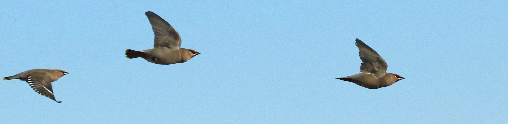
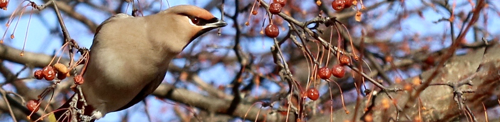

# BI279 Genetics

**Colby College  -  Fall 2025  -  Syllabus**

#### Meeting times

Mondays, Wednesdays, and Fridays 11:00-11:50am, in [Lovejoy 215](https://map.colby.edu/)

#### Instructor

[Dr. David R. Angelini](https://www.colby.edu/people/people-directory/dave-angelini/)

e-mail: [dave.angelini@colby.edu](mailto:dave.angelini@colby.edu)

Office hours: Wednesdays 12:00 - 1:00 pm, Thursdays 10:30 - noon, or by appointment

### Prerequisite

[BI164 Evolution & Diversity](https://github.com/aphanotus/openEd/tree/main/BI164.Evolution.and.Diversity#bi164-evolution--diversity)

### Course Description

Genetics is the study of heredity and its connections to living systems at all levels. This course covers basic genetic principles as revealed by classical and modern research methods. We will discuss patterns and mechanisms of gene transmission, the nature of chromosomes and their aberrations, the molecular structure of genes as well as their expression and interactions, applications of genetic technology and its ethical implications. The lecture component of the course is complemented by the lab, in which students will conduct experiments illustrating genetic concepts and employing recombinant DNA technology.

### Learning Objectives

Throughout this course, our goals are for students to:

- identify and describe core concepts of inheritance
- develop skills to reason through problems in genetics
- analyze genetic data and draw appropriate conclusions
- use scientific evidence to assess and contextualize genetics problems applicable to society
- communicate concepts of genetics clearly and accurately
- practice learning as an iterative process

### Readings

This course embraces an open educational philosophy. There is no required textbook. A variety of curated readings will be provided for each topic. These will be drawn mostly from the sources below.

- [Simons (2025) *Chromosomes, Genes, and Traits: An Introduction to Genetics*](https://rotel.pressbooks.pub/genetics/)
- [Singh (2023) *Introduction to Genetics*](https://opengenetics.pressbooks.tru.ca/)
- [Suza & Lee (2021) *Genetics, Agriculture, and Biotechnology*](https://iastate.pressbooks.pub/genagbiotech/)

Complete PDF versions of these texts are available on our Moodle page.

Students who wish to use a traditional textbook to supplement their learning may consider:

- [Klug et al. (2019) *Concepts of Genetics, 12th Edition*, Pearson/Benjamin Cummings](https://www.powells.com/books/search?query=Klug+Concepts+of+Genetics) 

Other readings from various sources will be provided via Moodle.

### Class meetings

Classes will involve a combination of instructor presentation, in-class **problem solving** individually and in groups, as well as class discussion. Therefore, attendance and your engagement are expected. Classes should be considered conversational, so please feel free to ask questions at any time. However, professional behavior is expected at all time, and includes the **use of electronic devices** only for tasks related to the course.

Class rosters are provided to each instructor with each student's legal name. I will gladly honor your request to address you by an **alternate name** or gender pronoun. Please advise me of this early in the semester so that I can make appropriate changes to my records.

Because of the interactive nature of this course, attendance and engagement are critical. Please contact me if you anticipate an absence from class. If you are aware in advance that you must miss class for exceptional circumstances, please discuss this with me in advance. Isolated, occasional **absences** are tolerable; frequent absences will negatively affect your participation grade.

Be aware that classes cannot be missed for an **athletic** practice. However, if your request is made in advance, I typically allow absences for athletic competition.

Discussions of genetics may raise issues of sexism, racism and colonialism. While this course will focus on biology, the social history of the topic must be acknowledged. Therefore, it is expected that conversations on these topics, while potentially uncomfortable, will be embraced with **respect**, compassion and mindful reflection. At any time, if anyone feels that readings, comments in discussion, or structures of the course treat these subjects inappropriately, that critique is welcomed, openly or privately.

### Grades

Your grade for BI279 will be based on a combination of points earned in the lecture and laboratory sections of the course. The specifics of your laboratory grade, and a lab syllabus, will be provided by your lab instructor. Your final grade for the course will be calculated based on a 1000 point total as listed below.

| course component                        | points |
| :-------------------------------------- | -----: |
| In-class participation                  |     45 |
| Quizzes (best 10 of 12 x 8 points each) |     80 |
| Problem sets (4 x 75 points each)       |    300 |
| Midterm exams (4 x 75 points each)      |    300 |
| Lab                                     |    275 |
| **total**                               |   1000 |

Students must earn a passing grade (>60%) in their lab section in order to pass the course.

Assignments are not accepted late, except in the case of a valid, compelling and documented justification.

No individual extra credit assignments will be offered.

| point range | final grade assigned                                |
| :---------- | :-------------------------------------------------- |
| > 900       | A (<930 A-, >930 A, A+ for exceptional performance) |
| 800-900     | B (<830 B-, 830-870 B, >870 B+)                     |
| 700-800     | C (<730 C-, 730-770 C, >770 C+)                     |
| 600-700     | D (<670 D, >670 D+)                                 |
| < 600       | F                                                   |

Remember that while diligent studying is typically essential for success, on its own effort is not sufficient to merit a high grade. The grade of “A” is meant to denote exceptional performance.

### Brief explanation of course assessments

This course will include a mix of formative and summative assessments. **Formative assessments** are meant to encourage you to build knowledge and skills, and they allow you to gauge your progress with the material before more high-stakes assessments. In these assignments you have flexibility to try (and perhaps fail) to apply skills and concepts with little or no contribution to your final grade at stake. However, to get the most out of this course, your engagement in every activity is necessary. You will encounter multiple overlapping concepts throughout the semester and review from previous courses. This design is intentional, because it will foster greater fluency and deeper understanding. **Summative assessments**, such as exams allow you to demonstrate mastery of content and concepts.

- **Participation** can best be described as displaying your earnest attempt to engage the material. Although I encourage all of you to be active participants during in-class activities, I realize that different people may be comfortable expressing themselves in different contexts. Therefore, participation may also include questions after class or brought during office hours.

- **Quizzes** will be given regularly, typically via Moodle, and typically over the weekend. Quizzes are meant to be low-stakes tests of basic knowledge from the previous week’s material, providing an opportunity for us both to gauge how you’re doing. 

- **Problem sets** are formative assessments that will challenge you to apply facts and concepts covered in class. Your answers should be descriptive, even when questions require a specific numerical answer. The logical steps used to arrive at the answer must be included. Students may consult any source they choose and work together when answering the questions, but each student must turn in answers explained in their own words. The highest grades will require creative solutions to novel questions. Problem sets will be made available for at least one week, around the time of an exam. Problem sets and midterm exams will cover similar content in different formats.

- **Midterm exams** are summative assessments meant to sample your knowledge and understanding. You will be expected to know specific facts, basic concepts, and the purpose and interpretation of experiments. Each exam will include a mix of questions in different formats. Exams will be given in class. If you know that you have a conflict with a scheduled exam date, such as for an athletic competition or religious observance, please notify me at least one week in advance and, if possible, arrangements will be made to accommodate your request. 

  > Students with **accommodations for extra time** will need to share their availability with me to arrange proctoring at the [Alternative Testing Center](https://life.colby.edu/get-support/access-disability-services/#:~:text=Using%20The-,Alternative,-Testing%20Center). This will typically be a time within 48 hours of the scheduled exam. Please be aware that the ATC is open for proctoring Mondays through Fridays from 8:15AM to 5:00PM.

- **The lab** will give you hands-on experience exploring the principles of genetics discussed in class. You will learn about the proper use of equipment, manipulation of DNA, methods of data analysis, and practice scientific communication. Most aspects of the laboratory will be managed by your lab instructor. Please be aware that a passing grade in your lab section is required to pass the course.

If you plan to observe religious holidays that coincide with class meetings or assignment due dates, please consult with me in the first three weeks of classes so that we may reach a mutual understanding of how you can meet the terms of your religious observance and the requirements for this course.

Late assignments without prior approval will be penalized 10% of the grade for each late day. Assignments that are late more than 7 days will not be accepted.

### Learning management platform (Moodle)

Moodle ( http://moodle.colby.edu/ ) will be my primary method for communicating materials and announcements to you outside of class. There you will also find links to the course [syllabus](https://github.com/aphanotus/openEd/blob/main/BI164.Evolution.and.Diversity/README.md) and the schedule of topics, assignments, and PDF files from lecture slides. 

### Access and Support

First, please speak with me early if you are having trouble in the course.

- [Counseling Services](http://www.colby.edu/counseling/) (207-859-4490) provided from the Health Center offer professional, confidential consultations regarding family problems, stress, depression, cultural adjustments, concerns with sexuality, alcohol and drug use, trauma and other personal issues.
- [Class Deans](mailto:deanofstudies@colby.edu) can guide students through a range of issues. Students can reach out to their class dean via email or by calling x4560. They are also welcome to visit the Dean of Studies Office in Eustis 107 for assistance with scheduling or other inquiries.
- If you encounter barriers to your full participation in this course, please let me know immediately so we can determine if there is an accommodation that can be made. If you are a student with a disability, or think you may have a disability, the [Dean of Students Office](https://www.colby.edu/studentadvising/student-access-and-disability-services/) works with students and faculty to identify reasonable accommodations.
- The [Farnham Writing Center](http://web.colby.edu/farnham-writerscenter/) offers support for students on basic writing and reading skills.
- [DavisConnects](https://davisconnects.colby.edu/) helps students explore internship, career, and study abroad opportunities. Make [an appointment](https://colby.joinhandshake.com/login) with an advisor through the Handshake portal.

### Sustainability

Environmental degradation is a serious biological and societal issue. [Colby](https://www.colby.edu/green-colby/) is committed to practices that promote environmental sustainability. To help minimize the environmental impact of this course, I encourage you to buy used textbooks. Minimize paper use by reading slides on a device when possible, rather than printing on paper. It is acceptable to take notes on a laptop or tablet during class. If you choose to print, please print double-sided on recycled paper. Multiple slides may be printed to a single sheet. Recycle unnecessary paper after the end of the semester.

### Academic Integrity

Honesty, integrity, and personal responsibility are cornerstones of a Colby education and provide the foundation for scholarly inquiry, intellectual discourse, and an open and welcoming campus community. [These values](https://www.colby.edu/academics/academic-integrity/) are central to this course. You are expected to demonstrate academic honesty in all aspects of this course. Academic dishonesty includes, but is not limited to: [plagiarism](https://libguides.colby.edu/avoidingplagiarism) (which includes paraphrasing from sources, even with a citation); claiming the work of another person or [AI](https://www.edweek.org/technology/new-data-reveal-how-many-students-are-using-ai-to-cheat/2024/04) as your own; buying or attempting to buy papers or other assignments; fabricating information or citations; knowingly assisting others in acts of academic dishonesty; violating clearly stated rules for taking an exam; misrepresentations to faculty within the context of a course; and submitting the same work, including an essay that you wrote, in more than one course. Sanctions for academic dishonesty are assigned by an [academic review board](https://www.colby.edu/wp-content/uploads/2021/01/StudentAcadDishFlowChart-7.pdf) and may include failure on the assignment, failure in the course, suspension or expulsion from the College.

### Sexual Misconduct

Colby College prohibits [sexual misconduct or gender-based discrimination](https://life.colby.edu/your-safety/sexual-violence-title-ix/title-ix-policy-guidance/) and is obligated, by federal and state laws, to respond to reports and provide resources to students. As your professor I am considered a "responsible employee" which requires me to report incidence of sexual assault, sexual harassment, dating violence, or stalking to the [Title IX Coordinator](https://life.colby.edu/your-safety/sexual-violence-title-ix/meet-the-staff/).

Confidential support services:

- [Counseling Services](http://www.colby.edu/counseling/) (207-859-4490)
- [Title IX Confidential Advocate](https://life.colby.edu/your-safety/sexual-violence-title-ix/meet-the-staff/) (207-509-9122)
- [Office of Religious and Spiritual Life](https://life.colby.edu/what-to-do/spiritual-life/) (207-859-4272 )
- [Maine Coalition Against Sexual Assault](https://www.mecasa.org/) (24/7 helpline: 1-800-871-7741)

### Accommodations for public health

If you experience symptoms of a contagious respiratory illness, such as [covid-19](https://www.cdc.gov/covid/signs-symptoms/) or [flu](https://www.cdc.gov/flu/signs-symptoms/index.html), please attend class if wearing a [KN-95](https://www.cdc.gov/respiratory-viruses/prevention/masks.html) face mask or similar design.

### Tentative Course Schedule

| week | date         | Topic                                            | Reading                                                      |
| :--: | ----------------- | ------------------------------------------------ | ------------------------------------------------------------ |
|  1   | Sept 3  | The chemical nature of inheritance               | Klug Ch10.3                                                  |
|      | Sept 3  | History of the discovery of DNA                  | [Cobb & Comfort (2023)](https://www.nature.com/articles/d41586-023-01313-5) |
|      |              | Review of DNA structure                          | [Simons (2025) p19-23](https://rotel.pressbooks.pub/genetics/chapter/the-chemical-nature-of-nucleic-acids/) |
|      |              | Genome structure                                 | [Simons (2025) p63-66](https://rotel.pressbooks.pub/genetics/chapter/eukaryotic-genomes-are-mostly-non-coding-sequence/) |
|  2   | Sept 8  | The structure of genes and regulatory elements   | Klug Ch21.3-6                                                |
|      |              | Bioinformatic basics                             | Klug p233                                                    |
|      |              | Chromatin accessibility                          | Klug Ch21.4                                                  |
|      | Sept 10 | The Gal4/UAS technique                           | [Chow (2017)](https://blog.addgene.org/quick-guide-to-working-with-drosophila-part-2-controlling-gene-expression-in-flies-with-gal4/uas); [Duffy (2002)](https://onlinelibrary.wiley.com/doi/epdf/10.1002/gene.10150) |
|      |              | Semiconservative DNA replication                 | [Suza & Lee (2021) p20-21](https://iastate.pressbooks.pub/genagbiotech/chapter/dna-the-genetic-material-2/) |
|      | Sept 12 | PCR                                              | [Suza & Lee p40-50](https://iastate.pressbooks.pub/genagbiotech/chapter/pcr-and-gel-electrophoresis/) |
|  3   | Sept 15 | Cellular DNA replication                         | [Simons p105-112](https://rotel.pressbooks.pub/genetics/chapter/mechanism-of-replication/) |
|      |              | Telomeres                                        | [Fowler p205-206](https://openstax.org/books/concepts-biology/pages/9-2-dna-replication) |
|      | Sept 17 | Chain-termination DNA sequencing                 | Klug Ch20.5                                                  |
|      | Sept 19 | High-throughput DNA sequencing                   | [Illumina (2010)](https://www.illumina.com/documents/products/techspotlights/techspotlight_sequencing.pdf) |
|      |              | Hybridization Methods                            |                                                              |
|  4   | Sept 22 | **Exam 1**                                       |                                                              |
|      | Sept 24 | Restriction endonucleases                        | Klug Ch20.0-1                                                |
|      |              | Gene editing                                     | [Redman et al. (2016)](https://pmc.ncbi.nlm.nih.gov/articles/PMC4975809/) |
|      | Sept 26 | Ethics of gene editing                           | [NIH (2017)](https://www.genome.gov/about-genomics/policy-issues/Genome-Editing/ethical-concerns) |
|  5   | Sept 29 | Transcription                                    | [Simons p123-132](https://rotel.pressbooks.pub/genetics/chapter/overview-of-transcription-chemistry/) |
|      |              | Eukaryotic mRNA processing                       | [Simons p140-144](https://rotel.pressbooks.pub/genetics/chapter/rna-processing-of-rna-pol-ii-transcripts/) |
|      |              | Alternative splicing                             | [Simons p144-145](https://rotel.pressbooks.pub/genetics/chapter/rna-processing-of-rna-pol-ii-transcripts/) |
|      | Oct 1    | The genetic code                                 | Klug Ch13.1-2,4,6                                            |
|      |              | tRNA wobble                                      | Klug Ch13.4                                                  |
|      | Oct 3    | The history of the discovery of the genetic code | Klug Ch13.3                                                  |
|      |              | Translation                                      | [Suza & Lee Ch6](https://iastate.pressbooks.pub/genagbiotech/chapter/gene-expression-part-2-translation/) |
|  6   | Oct 6    | Genetic and allelic nomenclature                 | [Singh Ch6.8](https://opengenetics.pressbooks.tru.ca/chapter/mullers-morphs/) |
|      |              | DNA mutation                                     | [Simons p189-199](https://rotel.pressbooks.pub/genetics/chapter/part-i-types-of-mutations/) |
|      |              | Gene regulation in bacteria                      | [Simons p236-245, 252-257](https://rotel.pressbooks.pub/genetics/chapter/one-promoter-can-be-regulated-by-both-activators-and-repressors-the-lac-operon/) |
|      | Oct 8    | Gal1 regulation in yeast                         | Klug Ch17.6                                                  |
|      |              | Eukaryotic gene regulation                       | [Simons p263-266](https://rotel.pressbooks.pub/genetics/chapter/review-of-transcriptional-regulation/), [269-272](https://rotel.pressbooks.pub/genetics/chapter/three-dimensional-structures-matter/) |
|      |              | Eukaryotic chromatin structure                   | [Simons p501-503](https://rotel.pressbooks.pub/genetics/chapter/chromatin-and-chromatin-dynamics/) |
|      | Oct 10   | Epigenetics                                      | [Simons p513-523](https://rotel.pressbooks.pub/genetics/chapter/epigenetics-in-action/) |
|      |              | DNA methylation                                  | [Simons p508-509](https://rotel.pressbooks.pub/genetics/chapter/methylation-of-dna-is-associated-with-decreased-transcription/) |
|      |              | Genomic imprinting                               | [Simons p512-513](https://rotel.pressbooks.pub/genetics/chapter/epigenetics-in-action/) |
|      |              | microRNAs                                        | [Simons p274-275](https://rotel.pressbooks.pub/genetics/chapter/additional-levels-of-gene-regulation/) |
|      |              | RNA interference                                 | [Simons p275-277](https://rotel.pressbooks.pub/genetics/chapter/additional-levels-of-gene-regulation/) |
|  7   | Oct 15   | **Exam 2**                                       |                                                              |
|      | Oct 17   | Germline vs. soma                                | [Singh Ch6.2](https://opengenetics.pressbooks.tru.ca/chapter/somatic-vs-germline-mutations/) |
|      |              | Mitosis                                          | [Simons p76-78](https://rotel.pressbooks.pub/genetics/chapter/m-phase-mitosis-2/) |
|      |              | Meiosis                                          | [Singh Ch1.3](https://opengenetics.pressbooks.tru.ca/chapter/meiosis-i/) |
|  8   | Oct 20   | Transmission genetics                            | [Simons p307-320](https://rotel.pressbooks.pub/genetics/part/mendel-and-basic-heredity/) |
|      |              | Allelic segregation                              | [Suza & Lee Ch13](https://iastate.pressbooks.pub/genagbiotech/chapter/mendelian-genetics/) |
|      |              | Independent assortment                           | [Singh Ch 2.1-2,4](https://rotel.pressbooks.pub/genetics/chapter/mendels-second-law/) |
|      | Oct 22   | Pedigree notation                                | [Singh Ch4.1-3](https://opengenetics.pressbooks.tru.ca/chapter/introduction-4/) |
|      |              | Statistical tests of offspring ratios            | [Simons p326-328](https://rotel.pressbooks.pub/genetics/chapter/using-the-rules-of-probability-to-solve-problems/) |
|      | Oct 24   | Partial dominance of alleles                     | [Simons p339-340](https://rotel.pressbooks.pub/genetics/chapter/incomplete-dominance/) |
|      |              | Codominance of alleles                           | [Singh Ch6.5](https://opengenetics.pressbooks.tru.ca/chapter/complete-dominance-and-recessive/#chapter-684-section-3) |
|      |              | The nature of allelic dominance                  | [Singh Ch6.6](https://opengenetics.pressbooks.tru.ca/chapter/biochemical-basis-of-dominance/) |
|      |              | Three or more alleles at one locus               | Klug Ch4.5                                                   |
|  9   | Oct 27   | Lethal alleles                                   | [Singh Ch6.7](https://opengenetics.pressbooks.tru.ca/chapter/mutant-classification/#chapter-705-section-2) |
|      |              | Pleiotropy                                       | [Simons p347-348](https://rotel.pressbooks.pub/genetics/chapter/pleiotropy/) |
|      |              | Gene interactions                                | [Singh Ch8.1](https://opengenetics.pressbooks.tru.ca/chapter/introduction-8/); [Simons p371-375](https://rotel.pressbooks.pub/genetics/chapter/molecular-genetics-of-epistasis/) |
|      |              | Epistasis                                        | [Singh Ch8.3](https://opengenetics.pressbooks.tru.ca/chapter/complete-dominance-and-recessive/#chapter-684-section-3) |
|      |              | Genetic background                               | Klug Ch4.13                                                  |
|      |              | Complementation                                  | [Singh Ch5.1-3](https://opengenetics.pressbooks.tru.ca/chapter/introduction-5/) |
|      | Oct 29   | Sex limitation & sex influence                   | Klug Ch4.12                                                  |
|      |              | Maternal effect inheritance                      | [Simons p287-289](https://rotel.pressbooks.pub/genetics/chapter/successive-action-of-maternal-effect-gap-pair-rule-segment-polarity-and-homeotic-genes/) |
|      | Oct 31   | Sex chromosome linkage                           | [Singh 10.1](https://opengenetics.pressbooks.tru.ca/chapter/introduction-10/),[2](https://opengenetics.pressbooks.tru.ca/chapter/autosomes-and-sex-chromosomes/),[4](https://opengenetics.pressbooks.tru.ca/chapter/sex-linkage-an-exception-to-mendels-first-law/) |
|      |              | Sex chromosomes                                  | [Simons p395-396](https://rotel.pressbooks.pub/genetics/chapter/the-genetics-of-sex-chromosomes-and-sex-development/) |
|      |              | Sex determination                                | [Simons p397-402](https://rotel.pressbooks.pub/genetics/chapter/the-genetics-of-sex-chromosomes-and-sex-development/) |
|  10  | Nov 3   | **Exam 3**                                       |                                                              |
|      | Nov 5   | Homologous recombination                         | Klug Ch11.8                                                  |
|      |              | Genetic distance                                 | [Simons p453-456](https://rotel.pressbooks.pub/genetics/chapter/not-all-genes-independently-assort/), [457-459](https://rotel.pressbooks.pub/genetics/chapter/thomas-hunt-morgan-and-alfred-sturtevant-chromosome-mapping-via-linkage-analysis/), [460-464](https://rotel.pressbooks.pub/genetics/chapter/calculating-map-distances-with-a-dihybrid-testcross/), [465-467](https://rotel.pressbooks.pub/genetics/chapter/50-recombination-frequency-is-the-max-but-chromosomes-are-longer-than-50-map-units/) |
|      |              | The physical basis of crossing over              | Klug Ch5.8                                                   |
|      |              | Haplotypes                                       | [Simons p483-485](https://rotel.pressbooks.pub/genetics/chapter/haplotypes/) |
|      | Nov 7   | Classical 3-point mapping                        | [Simons p468-474](https://rotel.pressbooks.pub/genetics/chapter/multiple-crossovers-the-three-point-testcross/), [Singh Ch11.4](https://opengenetics.pressbooks.tru.ca/chapter/where-do-crossovers-occur-on-a-chromosome/) |
|  11  | Nov 10  | Modern molecular mapping                         | [Simons p479-482](https://rotel.pressbooks.pub/genetics/chapter/dna-variants-can-be-molecular-markers-for-linkage/) |
|      |              | Chromosomal mapping                              |                                                              |
|      |              | Interval mapping                                 |                                                              |
|      |              | Genome-wide association mapping                  | [Simons p486-491](https://rotel.pressbooks.pub/genetics/chapter/genome-wide-association-studies-gwas/) |
|      |              | GWAS applications                                |                                                              |
|      |              | Human ancestry                                   | Ball et al. (2020)                                           |
|      | Nov 12  | Haploid gene-to-centromere mapping               | Klug 10/E Ch 5.10                                            |
|      |              | Tetrad analysis                                  | Klug 10/E Ch 5.10                                            |
|      | Nov 14  | Aneuploidy                                       | [Fowler Ch7.3](https://openstax.org/books/concepts-biology/pages/7-3-variations-in-meiosis) |
|      |              | Inversions & Translocations                      | Klug Ch8.7-8                                                 |
|      |              | Balancer chromosomes                             | [Introduction to Balancers](https://bdsc.indiana.edu/stocks/balancers/balancer_intro.html) |
|  12  | Nov 17  | Cancer genetics                                  | Simons p[561-565](https://rotel.pressbooks.pub/genetics/chapter/repair-of-dna-damage/), [577-582](https://rotel.pressbooks.pub/genetics/chapter/cancer-is-caused-by-dysregulation-of-the-cell-cycle/), [584-587](https://rotel.pressbooks.pub/genetics/chapter/examples-of-tumor-suppressor-proteins/), [589-592](https://rotel.pressbooks.pub/genetics/chapter/cancer-requires-multiple-mutations-2/) |
|      |              | Hereditary cancer                                | [Simons p593-595](https://rotel.pressbooks.pub/genetics/chapter/familial-vs-sporadic-cancers/) |
|      |              | Cancer epigenetics                               | [Simons p596-598 ](https://rotel.pressbooks.pub/genetics/chapter/epigenetics-and-cancer/) |
|      | Nov 19  | Meiotic drive                                    | [Reinhold et al. (1999)](https://pmc.ncbi.nlm.nih.gov/articles/instance/1690076/pdf/10445289.pdf) |
|      |              | Gene drive technology                            |                                                              |
|      |              | Gene drive applications                          | [Kuta (2022)](https://www.smithsonianmag.com/smart-news/first-us-open-air-test-of-genetically-modified-mosquitoes-deemed-a-success-180979960/) |
|      | Nov 21  | **Exam 4**                                       |                                                              |
|  13  | Dec 1   | Eugenics                                         |                                                              |
|      |              | Lysenkovshchina                                  | [Dugatkin (2021)](https://nautil.us/the-botanist-who-defied-stalin-238183/) |
|      | Dec 3   | Application of genetics in agriculture (GMOs)    | [Suza & Lee Ch12](https://iastate.pressbooks.pub/genagbiotech/chapter/genetic-engineering/) |
|      |              | Genetics, copyright, and privacy                 | [Francis (2014)](https://pmc.ncbi.nlm.nih.gov/articles/PMC4888827/) |
|      |              | Genetic evidence in US law                       |                                                              |
|      | Dec 5   | Personal genomics                                | Klug Ch22.4-7,9; ST3                                         |
|      |              | Ethics of human gene editing                     | Klug Ch22.9; ST1; ST5                                        |
